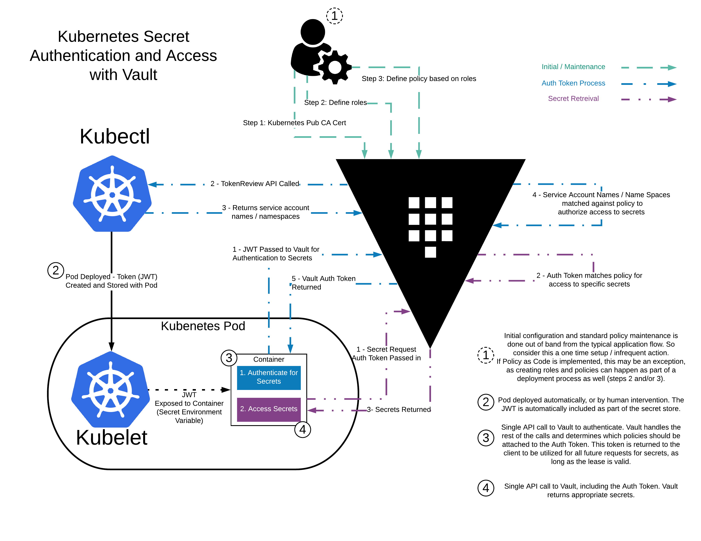

# Integrate vault with k8s with statful storage using Consul



## Prerequest

- Vault
- MiniKube (for simple k8s)
- helm (for installing consul & vault)
- kubectl (optional)

# Using internal vault K8S


## install minikube

```bash
curl -LO https://storage.googleapis.com/minikube/releases/latest/minikube-linux-amd64
sudo install minikube-linux-amd64 /usr/local/bin/minikube
```

## Start minikube 

```bash
minikube start && minikube tunnel
```

## install helm

```bash
curl -LO https://get.helm.sh/helm-v3.7.2-linux-amd64.tar.gz
tar -C /tmp/ -zxvf helm-v3.7.2-linux-amd64.tar.gz
rm helm-v3.7.2-linux-amd64.tar.gz
mv /tmp/linux-amd64/helm /usr/local/bin/helm
chmod +x /usr/local/bin/helm

```

## checking nodes k8s

```bash
kubectl get nodes -o wide
```

## Install consul using template from helm

- Prepare add repository from  `hashicorp` :

```bash
helm repo add hashicorp https://helm.releases.hashicorp.com
```

- Find version of `consul` are available in helm : 

```bash
helm search repo hashicorp/consul --versions
```

- Set values for consul like this and save as consul-value.yaml for setup deployment consul

```yaml
global:
  datacenter: vault-kubernetes-guide

client:
  enabled: true

server:
  replicas: 1
  bootstrapExpect: 1
  disruptionBudget:
    maxUnavailable: 0
```

- Create template for deployment consul from helm : 

```bash
helm template consul hashicorp/consul \
  --namespace vault \
  --version 0.41.0 \
  -f consul-value.yaml \
  > consul.yaml
```

- Deploy consul services : 

```bash
kubectl create ns vault 
kubectl -n vault apply -f consul.yaml
kubectl -n vault get pods
```

## Create TLS End to End Encryption using CFSSL

- prepare file ca-csr.json and ca-config.json for generate certificate 

ca-csr.json : 
```json
{
  "hosts": [
    "cluster.local"
  ],
  "key": {
    "algo": "rsa",
    "size": 2048
  },
  "names": [
    {
      "C": "ID",
      "L": "JABAR",
      "O": "Example",
      "OU": "CA",
      "ST": "Example"
    }
  ]
}
```

ca-config.json : 
```json
{
  "signing": {
    "default": {
      "expiry": "175200h"
    },
    "profiles": {
      "default": {
        "usages": ["signing", "key encipherment", "server auth", "client auth"],
        "expiry": "175200h"
      }
    }
  }
}
```


```bash
docker run -it --rm -v ${PWD}:/work -w /work debian bash

apt-get update && apt-get install -y curl &&
curl -L https://github.com/cloudflare/cfssl/releases/download/v1.6.1/cfssl_1.6.1_linux_amd64 -o /usr/local/bin/cfssl && \
curl -L https://github.com/cloudflare/cfssl/releases/download/v1.6.1/cfssljson_1.6.1_linux_amd64 -o /usr/local/bin/cfssljson && \
chmod +x /usr/local/bin/cfssl && \
chmod +x /usr/local/bin/cfssljson

# Generate ca in /tmp
cfssl gencert -initca ca-csr.json | cfssljson -bare /tmp/ca

# Generate certificate in /tmp
cfssl gencert \
  -ca=/tmp/ca.pem \
  -ca-key=/tmp/ca-key.pem \
  -config=ca-config.json \
  -hostname="vault,vault.vault.svc.cluster.local,vault.vault.svc,localhost,127.0.0.1" \
  -profile=default \
  ca-csr.json | cfssljson -bare /tmp/vault

# Checking files
ls -l /tmp

# Move files to work

mv /tmp/* /work
```

## Create the TLS secret

```bash
kubectl -n vault create secret tls tls-ca \
 --cert ca.pem  \
 --key ca-key.pem

kubectl -n vault create secret tls tls-server \
  --cert vault.pem \
  --key vault-key.pem
```

## Install vault using template from helm

- Preapre version for `vault` :

```bash
helm search repo hashicorp/vault --versions
```

- Create values for helm vault template as vault-value.yaml : 

```yaml
# Vault Helm Chart Value Overrides
global:
  enabled: true
  tlsDisable: false

injector:
  enabled: true
  # Use the Vault K8s Image https://github.com/hashicorp/vault-k8s/
  image:
    repository: "hashicorp/vault-k8s"
    tag: "0.14.1"

  resources:
      requests:
        memory: 50Mi
        cpu: 50m
      limits:
        memory: 256Mi
        cpu: 250m

server:
  image:
    repository: "hashicorp/vault"
    tag: "1.9.2"

  # These Resource Limits are in line with node requirements in the
  # Vault Reference Architecture for a Small Cluster
  resources:
    requests:
      memory: 50Mi
      cpu: 500m
    limits:
      memory: 16Gi
      cpu: 2000m

  # For HA configuration and because we need to manually init the vault,
  # we need to define custom readiness/liveness Probe settings
  readinessProbe:
    enabled: true
    path: "/v1/sys/health?standbyok=true&sealedcode=204&uninitcode=204"
  livenessProbe:
    enabled: true
    path: "/v1/sys/health?standbyok=true"
    initialDelaySeconds: 60

  # extraEnvironmentVars is a list of extra environment variables to set with the stateful set. These could be
  # used to include variables required for auto-unseal.
  extraEnvironmentVars:
    VAULT_CACERT: /vault/userconfig/tls-ca/tls.crt

  # extraVolumes is a list of extra volumes to mount. These will be exposed
  # to Vault in the path `/vault/userconfig/<name>/`.
  extraVolumes:
    - type: secret
      name: tls-server
    - type: secret
      name: tls-ca

  standalone:
    enabled: false

  # Run Vault in "HA" mode.
  ha:
    enabled: true
    replicas: 1 # for singel vault server
    config: |
      ui = true
       
      listener "tcp" {
        tls_disable = 0
        address     = "0.0.0.0:8200"
        tls_cert_file = "/vault/userconfig/tls-server/tls.crt"
        tls_key_file = "/vault/userconfig/tls-server/tls.key"
        tls_min_version = "tls12"
      }

      storage "consul" {
        path = "vault"
        address = "consul-consul-server:8500"
      }

# Vault UI
ui:
  enabled: true
  externalPort: 8200
```

- Create template `vault`from helm :

```bash
helm template vault hashicorp/vault \
  --namespace vault \
  --version 0.22.0 \
  -f vault-values.yaml \
  > vault.yaml
```

- Deploy `vault` : 

```bash
kubectl -n vault apply -f vault.yaml
kubectl -n vault get pods
```

## Initialize Vault

```bash
kubectl -n vault exec -it <POD-NAME-VAULT> -- sh
vault operator init
vault operator unseal
vault status
```

## Check on web UI

```bash
kubectl -n vault get svc
```

## Enable Kubernetes Authentication

```bash
kubectl -n vault exec -it <POD-NAME-VAULT> -- sh 

vault login
vault auth enable kubernetes

vault write auth/kubernetes/config \
token_reviewer_jwt="$(cat /var/run/secrets/kubernetes.io/serviceaccount/token)" \
kubernetes_host=https://${KUBERNETES_PORT_443_TCP_ADDR}:443 \
kubernetes_ca_cert=@/var/run/secrets/kubernetes.io/serviceaccount/ca.crt \
issuer="https://kubernetes.default.svc.cluster.local"
exit
```

# EXAMPLE Basic Secret Injection

- Setup policy vault : 
```bash
#Create a role for our app

kubectl -n vault exec -it  <POD-NAME-VAULT>  -- sh 

vault write auth/kubernetes/role/basic-secret-role \
   bound_service_account_names=basic-secret \
   bound_service_account_namespaces=example-app \
   policies=basic-secret-policy \
   ttl=1h
```

- Create policy to map service account to bunch of secret 

```bash
kubectl -n vault exec -it  <POD-NAME-VAULT>  -- sh 

cat <<EOF > /home/vault/app-policy.hcl
path "secret/basic-secret/*" {
  capabilities = ["read"]
}
EOF
vault policy write basic-secret-policy /home/vault/app-policy.hcl
```

- After setup policy we can create some secrets :

```bash
kubectl -n vault exec -it <POD-NAME-VAULT> -- sh 
vault secrets enable -path=secret/ kv
vault kv put secret/basic-secret/helloworld username=dbuser password=sUp3rS3cUr3P@ssw0rd
```

- Create deployment for testing as example.yaml: 

```yaml
apiVersion: apps/v1
kind: Deployment
metadata:
  name: basic-secret
  labels:
    app: basic-secret
spec:
  selector:
    matchLabels:
      app: basic-secret
  replicas: 1
  template:
    metadata:
      annotations:
        vault.hashicorp.com/agent-inject: "true"
        vault.hashicorp.com/tls-skip-verify: "true"
        vault.hashicorp.com/agent-inject-secret-helloworld: "secret/basic-secret/helloworld"
        vault.hashicorp.com/agent-inject-template-helloworld: |
          {{- with secret "secret/basic-secret/helloworld" -}}
          {
            "username" : "{{ .Data.username }}",
            "password" : "{{ .Data.password }}"
          }
          {{- end }}
        vault.hashicorp.com/role: "basic-secret-role"
      labels:
        app: basic-secret
    spec:
      serviceAccountName: basic-secret
      containers:
      - name: app
        image: jweissig/app:0.0.1
---
apiVersion: v1
kind: ServiceAccount
metadata:
  name: basic-secret
  labels:
    app: basic-secret
```

- Deploy : 

```bash
kubectl create ns example-app
kubectl -n example-app apply -f example.yaml
kubectl -n example-app get pods
```

- Checking : 

```bash
kubectl -n example-app exec <pod-name> -- sh -c "cat /vault/secrets/helloworld
```
